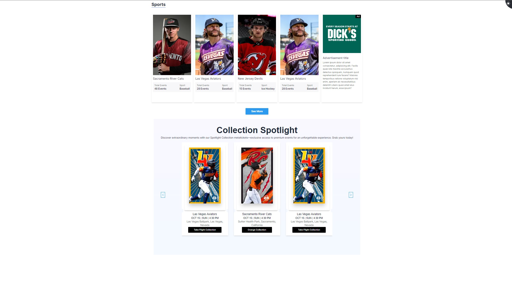
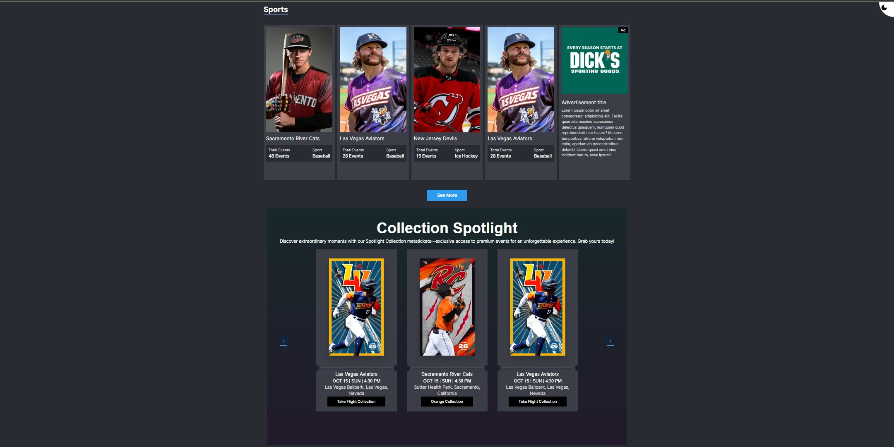
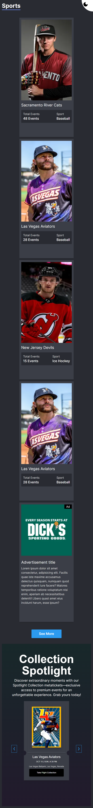

# Hexleap Frontend Assignment

## Technologies, Languages and Tools used

- Next.JS
- Typescript
- Tailwind CSS

## How to install and run the project

- Fork the project and clone to your local machine
```bash
    git clone https://github.com/MaorBemdoo/Hexleap-Frontend-Assigment
```
- Redirect to Hexleap-Frontend-Assigment folder
```cmd
    cd Hexleap-Frontend-Assigment
```
- Install node dependencies
```node
    npm install
```
- Open the live project on your web browser
```node
    npm run dev
```

## Demo

<div align="center">
    
    
    
</div>

**[Demo Link](https://bemdoom-hexleapfrontendassigment.vercel.app)**

## Author

|  |
|:--:|
|Github: [@MaorBemdoo](https://github.com/MaorBemdoo) <br> LinkedIn: [Bemdoo Maor](https://www.linkedin.com/in/bemdoo-maor-449698279/)|

## License

This repo is protected by the [MIT](LICENSE) License